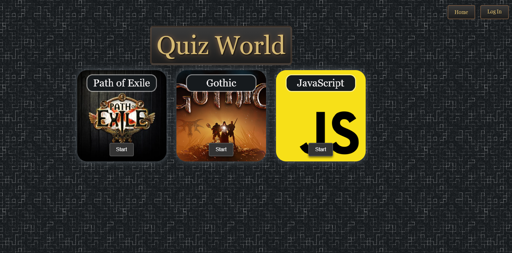
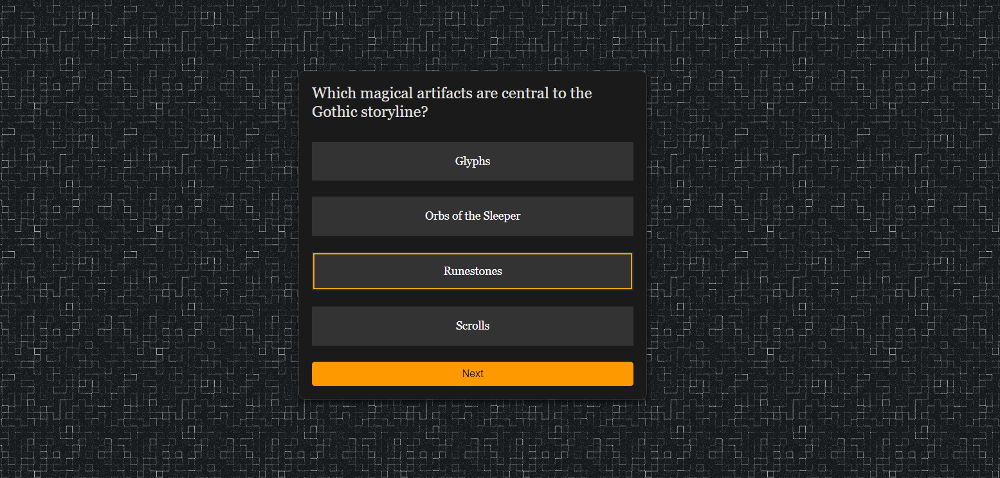
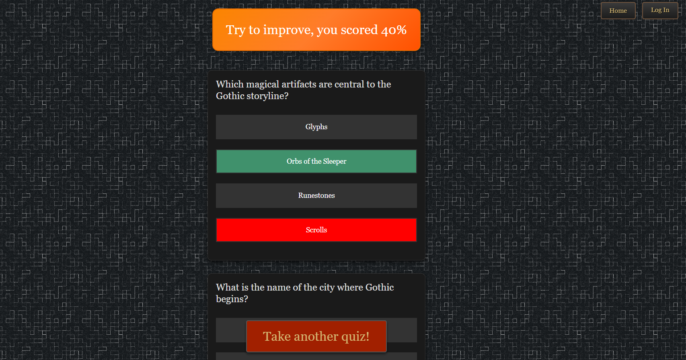
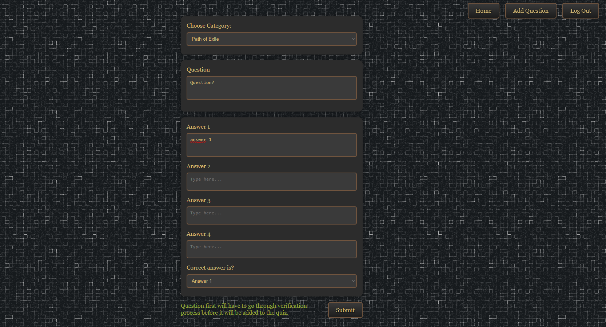
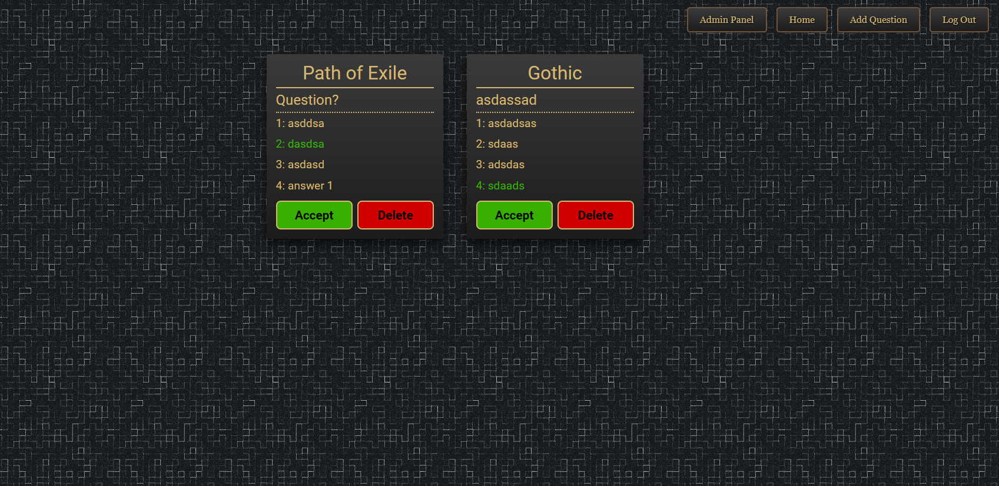

# Full-Stack Quiz Application

A full-stack quiz application built with **Node.js**, **React**, **HTML**, **CSS**, **JavaScript**, and **PostgreSQL**. The application allows users to take quizzes, view their results, and submit their own questions for review by administrators. Administrators can approve or reject submitted questions through an admin panel.

## Table of Contents

- [Features](#features)
- [Tech Stack](#tech-stack)

## Features

- **User Authentication**: Users can register, log in, and take quizzes.
- **Quiz Functionality**: Users can answer questions, submit the quiz, and view their score as a percentage.
- **Question Submission**: Users can submit quiz questions for admin approval.
- **Admin Panel**: Admins can approve or reject submitted questions.
- **PostgreSQL Database**: All data is stored in a PostgreSQL database.

## Tech Stack

**Backend**:
- Node.js
- Express.js
- PostgreSQL
- Sequelize ORM
- JSON Web Tokens (JWT) for authentication

**Frontend**:
- React.js
- HTML5, CSS3, JavaScript (ES6+)
- Bootstrap for UI components

### Home Page

### Quiz Page

### Finished Quiz Page

### Add Question Form

### Admin Panel

